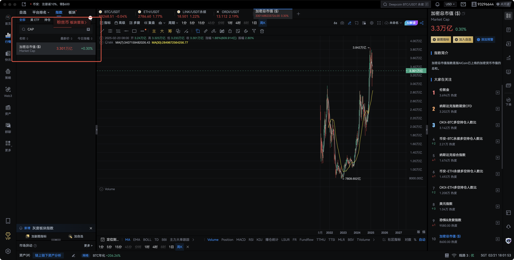
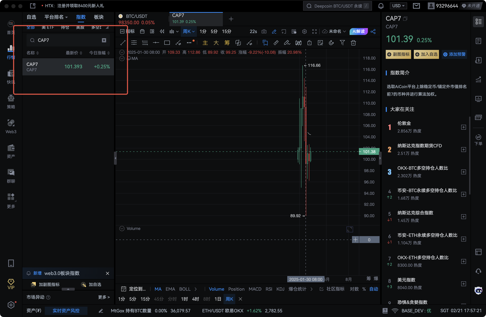
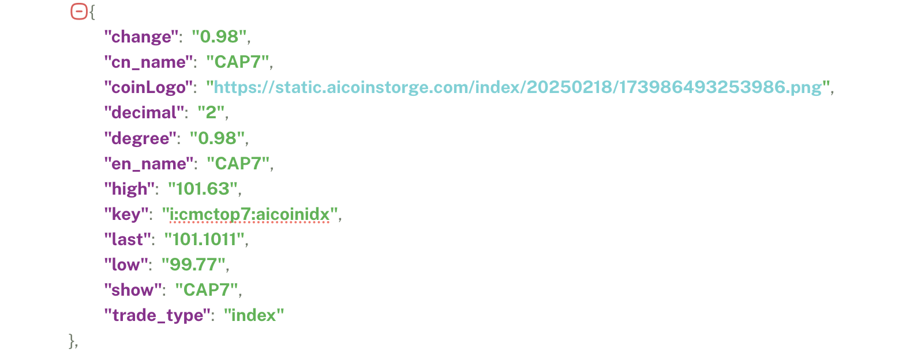
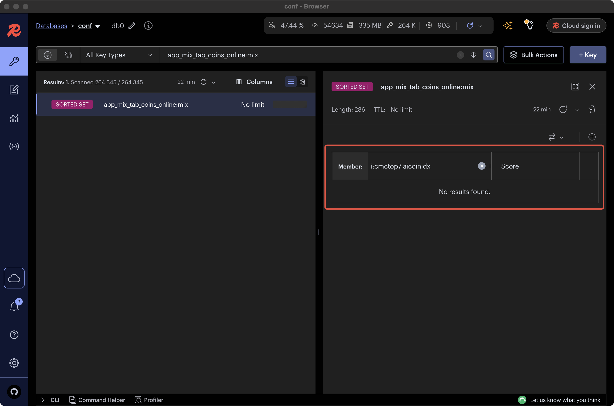

# 后台相关线上问题99号问题 反馈

- 应用端：PC端
- 记录人员：谢焰明
- 开发人员：易嘉鸣

## 具体问题

PC左侧指数列表，搜索不到 CAP7 指数，如下图所示：



## 问题分析

根据问题描述，我在**生产环境**复现了问题，确实存在搜索不到 CAP7 指数的情况。  
而后我在**测试环境**复现，发现能够搜索到 CAP7 指数，如下图所示：



定位代码，数据是从Redis中读取的，如下图所示：

```go
// go-pc-api/internal/service/market_service.go
// GetIndexList 获取指数列表
func GetIndexList(key string, typeKeys []string, quoteParam config.QuoteParamConfig) []map[string]string {
    data := make([]map[string]string, 0)
	indexList := []string{key}
	if key == "" {
		rdbKey := "app_mix_tab_coins_online:mix"
		if tools.IsDevelopEnv() {
			rdbKey = "app_mix_tab_coins_online_dev:mix"
		}
		indexList, _ = redisapi.ZRange(db.REDIS_DB_CONF, rdbKey, 0, -1, 0)
		if len(indexList) == 0 {
			return data
		}
		indexList = filterIndexKeyByType(indexList, typeKeys)
		if len(indexList) == 0 {
			return data
		}
	}

	data = getIndexDataByKeys(indexList, quoteParam)
	return data
}
```

已知`CAP7`指数对应的币类key为`i:cmctop7:aicoinidx`，如下图所示：



在Redis conf中查询 `app_mix_tab_coins_online:mix` ，发现不存在 `CAP7` 指数对应的币类key，如下图所示：



在Redis conf中查询 `app_mix_tab_coins_online_dev:mix` ，发现存在 `CAP7` 指数对应的币类key，如下图所示：


## 问题总结

Redis的conf中，`app_mix_tab_coins_online:mix` 没有 `CAP7` 指数对应的币类key。  
通过比较发现，`app_mix_tab_coins_online_dev:mix`的很多成员`app_mix_tab_coins_online_dev:mix`都没有，所以搜索不到的可能不止`CAP7` 这一个指数。  
同时在`php-task`项目中，也没有找到修改和写入`app_mix_tab_coins_online:mix`相关的代码，初步认为，该问题不是后台部门的问题。可能需要和数据部门的同事沟通。  

